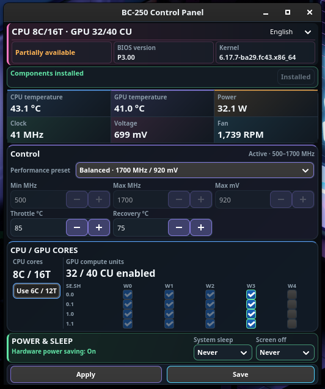

[English](README.md) | **한국어**

# BC-250 Custom Pannel

AMD BC-250에서 Bazzite를 사용할 때 상태 확인과 성능 설정을 한 화면에서 처리하는 GTK4 제어판입니다.



## 지원 환경

- AMD BC-250
- Bazzite x86_64
- Bazzite GNOME / Deck GNOME 또는 Bazzite KDE Plasma 5 / 6
- Wayland 세션

다른 GPU나 다른 Linux 배포판은 설치 대상이 아닙니다.

## 설치 및 첫 실행

저장소를 내려받은 직후 `run.sh`로 패널을 바로 실행할 수 있습니다.

```bash
git clone https://github.com/momopanda123/bc-250-custom-pannel.git
cd bc-250-custom-pannel
./run.sh
```

`run.sh`가 기본 실행 파일이며 `install-app.sh`는 필수가 아닙니다. GUI를 열지 않고 Bazzite 환경만 확인하려면 `./run.sh --check`를 사용합니다.

데스크톱 앱 목록에 **BC-250 Control Panel** 아이콘을 추가하려면 다음을 한 번만 실행합니다.

```bash
./install-app.sh
```

그 뒤 터미널을 닫고 앱 목록에서 패널을 실행합니다. 등록된 바로가기는 `Terminal=false`이므로 GUI만 표시됩니다. 이 단계는 현재 사용자 계정에 앱 바로가기만 만드는 것이며 시스템 구성요소 설치나 CPU/GPU 설정 변경을 하지 않습니다. 프로젝트 폴더를 옮겼다면 `install-app.sh`를 다시 실행합니다.

필요한 실행 파일과 서비스는 저장소에 포함되어 있으므로 별도로 Governor나 UMR을 찾아서 설치할 필요가 없습니다.

### 구성요소 설치

처음 실행했을 때 상단에 설치 또는 업데이트가 필요하다고 표시되면:

1. `Install components`를 누릅니다.
2. 시스템 인증을 완료합니다.
3. 표시가 `Components installed`로 바뀌면 설치가 끝난 것입니다.

필요한 구성요소가 모두 설치된 상태에서는 버튼이 비활성화됩니다. 구성요소 설치만으로 CPU/CU 설정이 변경되지는 않습니다.

## 사용 방법

### 상태 표시

상단에서 다음 정보를 확인할 수 있습니다.

- 현재 CPU 코어/스레드와 GPU CU
- BIOS 및 Linux 커널 버전
- CPU/GPU 온도
- GPU 전력, 클럭, 전압
- 팬 RPM

센서 값은 자동으로 갱신됩니다.

### Control

GPU 동작 설정을 선택합니다.

| 항목 | 기능 |
|---|---|
| Performance preset | 절전, 균형, 성능 또는 사용자 설정 |
| Min MHz / Max MHz | GPU 최소·최대 클럭 |
| Max mV | 고정 전압이 아닌 전압 상한 |
| Throttle °C | 이 온도에서 클럭을 낮추기 시작 |
| Recovery °C | 온도가 내려갔을 때 정상 클럭으로 복귀 |

`Custom`을 선택하면 값을 직접 입력할 수 있습니다. `0 MHz`는 해당 클럭 경계를 제한하지 않고, `0 mV`는 추가 전압 상한을 사용하지 않습니다. 기본 프리셋의 Recovery 온도가 Throttle 온도보다 낮은 것은 정상입니다.

### CPU / GPU CORES

#### CPU

- 토글을 켜면 8C/16T를 요청합니다.
- 토글을 끄면 6C/12T를 요청합니다.
- CPU 코어 변경은 재부팅 후 적용됩니다.
- 8C/16T를 저장한 상태에서 완전히 전원을 차단한 뒤 6C/12T로 돌아오면, 부팅 서비스가 언락을 다시 요청하고 필요한 경우 웜 재부팅을 한 번 수행합니다.

재부팅이 필요한 작업은 적용 후 안내창으로 표시됩니다.

#### GPU CU

- WGP 0–2는 기본 24 CU이므로 항상 켜져 있고 변경할 수 없습니다.
- 각 행의 WGP 3·4에서 추가 CU를 선택할 수 있습니다.
- 선택 가능한 범위는 24–40 CU이며 2 CU 단위로 변경됩니다.
- 체크 상태를 바꾼 뒤 `Apply` 또는 `Save`를 눌러야 적용됩니다.

GUI의 CU 활성화 표시는 선택한 레지스터 값이 실제로 다시 읽혔다는 뜻입니다. 추가 CU가 게임이나 장시간 부하에서 안정적이라는 보증은 아니므로, CU를 늘린 뒤에는 사용하는 게임이나 GPU 작업으로 안정성을 확인해야 합니다.

### POWER & SLEEP

`System sleep`과 `Screen off`에서 자동 절전 및 화면 꺼짐 시간을 선택합니다.

- `Never`: 자동 실행 안 함
- 5/10/15/30/60분: 지정 시간 사용
- `Custom`: 1–240분 직접 입력

데스크톱 세션에 따라 GNOME(`gsettings`) 또는 KDE Plasma(PowerDevil) 설정을 사용합니다. `Never`를 선택해도 CPU 유휴 대기와 GPU 자동 저전력 동작은 유지됩니다.

#### KDE Plasma 전원 설정

KDE 지원은 `kde-support` 브랜치에 있습니다. 실행 전에 해당 브랜치를 선택합니다.

```bash
git switch kde-support
```

- Plasma에 로그인한 일반 사용자로 실행하세요. `sudo`나 별도의 SSH 세션에서는 사용자 전원 관리에 접근하지 못할 수 있습니다.
- KDE에서도 GUI 실행에는 Python 3, PyGObject, GTK4가 필요합니다. 패널이 이 데스크톱 의존성을 자동 설치하지는 않습니다.
- 전원 설정에는 해당 버전의 `kwriteconfig5` 또는 `kwriteconfig6`, `busctl`, 실행 중인 PowerDevil 사용자 서비스가 필요합니다. `KDE_SESSION_VERSION`을 우선 확인하고, 없으면 `plasmashell --version`으로 판별합니다. 버전을 판별하지 못하면 설정을 쓰지 않습니다.
- Plasma 5는 `powermanagementprofilesrc`를 사용하며 절전 시간은 밀리초, 화면 꺼짐 시간은 초입니다. Plasma 6은 `powerdevilrc`의 활성화 플래그와 초 단위 시간을 사용합니다. 두 경우 모두 `XDG_CONFIG_HOME`, 미지정 시 `~/.config` 아래에서 읽고 씁니다.
- BC-250 데스크톱을 대상으로 **AC 전원 프로필만** 변경합니다. 배터리 프로필, 밝기, 화면 어둡게 하기, 화면 잠금 정책, 하드웨어 설정은 이 타이머로 변경하지 않습니다. KDE의 잠금 상태 전용 화면 꺼짐 시간은 별도로 적용될 수 있습니다.
- `Never`는 해당 동작을 명시적으로 비활성화하며 새로고침 뒤에도 유지됩니다. 절전 시간을 지정하면 기존 종료·최대절전 동작 대신 RAM 절전을 사용합니다.
- 저장 뒤 PowerDevil 사용자 D-Bus의 `refreshStatus`를 호출합니다. 도구 누락, 쓰기 실패, 새로고침 실패는 성공으로 처리하지 않습니다. 새로고침 실패 시 파일만 저장된 상태이며 나중에 서비스가 다시 읽으면 적용될 수 있습니다.
- 설정이 없거나 읽을 수 없으면 KDE의 실제 기본값을 확정할 수 없습니다. 이때 보이는 절전 15분·화면 꺼짐 5분은 편집용 대체값입니다. 전체 적용을 누르면 화면에 보이는 값이 기록됩니다.

기존 GNOME 동작과 동일하게 `Apply`와 `Save` 모두 데스크톱 타이머 설정을 영구 기록합니다. 두 버튼의 차이는 패널의 하드웨어 설정 저장에 해당합니다.

KDE 회귀 테스트는 Plasma 5/6별 설정 예제, 명령 규약, 저장 후 재조회 동작을 확인합니다. 실제 Bazzite/KDE 기기의 절전·화면 꺼짐 실측 테스트를 대신하지는 않습니다.

PowerDevil 참고: [Plasma 6 설정 정의](https://github.com/KDE/powerdevil/blob/master/PowerDevilProfileSettings.kcfg), [Plasma 5 → 6 변환 및 시간 단위](https://github.com/KDE/powerdevil/blob/master/daemon/powerdevilmigrateconfig.cpp).

### Apply와 Save

- `Apply`: 화면의 모든 변경 내용을 현재 세션에 적용합니다.
- `Save`: 모든 변경 내용을 적용하고 다음 부팅에도 사용할 설정으로 저장합니다.

각 카드별로 따로 적용할 필요 없이 화면 아래의 버튼 한 번으로 Control, CPU/GPU Cores, Power & Sleep 설정을 함께 처리합니다.

## 언어 변경

화면 오른쪽 위에서 한국어, English, 日本語, 简体中文을 선택할 수 있습니다. 선택한 언어는 다음 실행에도 유지됩니다.

## 제거

데스크톱 앱 목록의 바로가기만 제거하려면:

```bash
./uninstall-app.sh
```

설치된 시스템 구성요소까지 제거하려면 프로젝트 폴더에서:

```bash
pkexec python3 ./bc250_install.py remove --project-root "$PWD"
```

프로젝트 폴더와 사용자가 저장한 백업 파일은 자동으로 삭제하지 않습니다.

## 사용 전 주의

- CU, 클럭 또는 전압 설정을 변경하기 전에 실행 중인 작업을 저장하십시오.
- 추가 CPU 코어와 GPU CU의 안정성은 보드마다 다를 수 있습니다.
- 불안정한 설정은 게임 종료, 화면 멈춤 또는 시스템 재부팅을 일으킬 수 있습니다.
- 팬 속도는 표시만 하며 이 프로그램에서 제어하지 않습니다.
