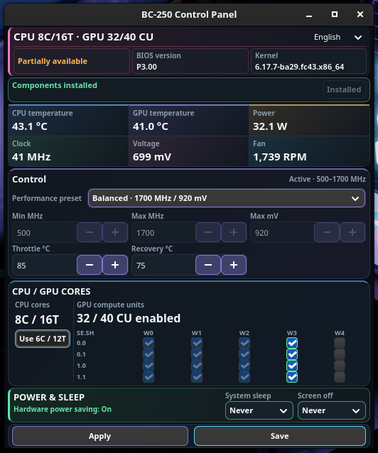

**English** | [한국어](README.ko.md)

# BC-250 Custom Pannel

BC-250 Custom Pannel is a GTK4 control panel for AMD BC-250 systems running Bazzite. It provides a single interface for monitoring GPU status and firmware information and for applying validated performance settings. The `Pannel` spelling is intentionally retained for compatibility with the existing project path.

This project is more than a Python GUI. It includes the GPU governor, CU boot manager, a Bazzite 43-compatible UMR binary, service files, and policy templates required at runtime. Their versions and SHA-256 hashes are pinned in the repository.



The image above shows the application running on Bazzite GNOME. Temperature, power, clock, fan, CPU, and CU readings vary depending on the device and current workload.

## Features

- Shows the current CPU core/thread count and GPU CU count together in the top summary
- Refreshes CPU/GPU temperature, GPU power, clock, voltage, and fan RPM every second
- Provides Power Saving, Balanced, and Performance presets plus a custom 500–1800 MHz GPU clock range
- Configures throttle and recovery temperatures using a validated voltage curve
- Saves 24, 32, or 40 CU profiles for the next boot
- Toggles between 6C/12T and 8C/16T according to the current CPU state
- Controls automatic suspend and display-off timers with Disabled, preset, and custom 1–240 minute options
- Displays BIOS and kernel information and supports Korean, English, Japanese, and Simplified Chinese
- Checks required components and installs only the missing items in one operation

## Supported systems

- AMD BC-250 (`1002:13fe`)
- Bazzite x86_64
- Bazzite GNOME or Deck GNOME image
- Wayland session

Other GPUs and general Fedora, Ubuntu, or Arch/CachyOS installations are not supported targets. The installer checks the platform first and stops without changing system files when the environment does not match.

## Quick start

From the cloned project directory, run:

```bash
./run.sh
```

The GUI opens first. The component status row is always visible, while the `Install components` button is enabled only when the governor, CU manager, UMR, privileged helper, or CPU mode service is missing. After you press the button once and complete system authentication, the installer verifies the SHA-256 hash of every bundled file and installs the missing files and services. The button is disabled when everything is present. No separate downloads or installation commands are required.

To register the application in the GNOME app grid, run once:

```bash
./install-app.sh
```

This script resolves the current clone location automatically. It does not hard-code a user name or installation path.

## Interface

### Compact real-time dashboard

The default window size is 600x700. It does not use a vertical scrolling container: real-time status, governor controls, CPU/GPU core controls, power/IDLE settings, and BIOS/kernel information are all visible in one window. The six sensors are arranged in one two-row status band in the following order:

The title bar shows overall status on the left, the application name in the center, and the refresh time and language selector on the right. The summary line below displays the current hardware state in a single line, such as `CPU 8C/16T · GPU 40/40 CU`. Major areas use distinct accent colors, while button and combo-box text is consistently white for readability on the dark background.

1. CPU temperature
2. GPU temperature
3. GPU power
4. GPU clock
5. SMU voltage
6. Active fan RPM

The GPU core area distinguishes the live CU count detected for the current boot from the saved next-boot CU profile. The CPU core area shows the current `6C / 12T` or `8C / 16T` state together with unlock availability.

Sensors refresh in the background every second so slow system calls do not freeze the window. Governor, throttle, recovery-temperature, and CU fields are populated only once at startup; later sensor refreshes do not overwrite user input. BC-250 GPU clock and software power sensors reported by the driver can differ from wall-power measurements under load. If the driver does not expose a sensor, the application displays `Unavailable` instead of inventing a value.

### Language

When the language is set to `Auto`, the application checks `LC_ALL`, `LC_MESSAGES`, and `LANG` in that order. Korean, English, 日本語, and 简体中文 can be selected directly from the header. Unsupported locales and missing translation keys fall back to English. The selection is stored in `~/.config/bc250-custom-pannel/settings.json` and is applied immediately without restarting the application.

### CPU and fan sensor safety

CPU temperature is read from the `Tctl` value of `k10temp` first, with the board sensor labeled `CPU` used as a fallback. Fan RPM is read from an `nct6686` or `nct6687` sensor. The application discovers hwmon devices by name and label on every refresh instead of hard-coding hwmon numbers. This release never writes PWM values; fan control is strictly read-only. Fan control remains out of scope until the physical device connected to `Pump Fan` has been verified.

### Power / IDLE

The `Automatic suspend` and `Display off` combo boxes control only the GNOME session timers. They provide Disabled, 5, 10, 15, 30, and 60 minute presets plus a custom setting. Selecting a value applies it immediately to the current user session. Choosing the custom setting reveals a 1–240 minute input field. Disabling both timers does not disable the CPU's MWAIT idle state or AMDGPU DPM automatic clock and power management. The application also displays the detected CPU IDLE method and GPU DPM mode.

On BC-250, the cpuidle driver file may report `none` while kernel logs and CPU capabilities still confirm MWAIT usage. In that case, the GUI displays `CPU MWAIT`. A GPU DPM value of `auto` means that automatic clock and power scaling is active according to load.

Automatic suspend is saved for both AC and battery sessions, while display-off time is stored as the GNOME idle timer. Disabled sets the corresponding timer to zero. These are user-session settings and do not require administrator authentication or a reboot.

### BIOS and kernel

- BIOS vendor
- BIOS version
- BIOS date
- Linux kernel version
- System architecture

The information is read from `/sys/class/dmi/id` and the running kernel. Administrator privileges are not required.

### Performance and temperature

| Preset | Clock range | Validated curve limit | Intended use |
|---|---:|---:|---|
| Power Saving | 500–1500 MHz | 900 mV | Lower heat and power consumption |
| Balanced | 500–1700 MHz | 920 mV | Balance between performance and efficiency |
| Performance | 500–1800 MHz | 930 mV | Highest setting validated on the current system |

`Apply now` sends the setting only to the governor D-Bus service; the saved configuration is restored after a reboot. `Apply and save` requests system authentication, backs up the existing configuration, atomically replaces the configuration file, and restarts the governor service.

Selecting `Custom` below the presets allows direct minimum and maximum GPU clock configuration within 500–1800 MHz. The values must be at least 100 MHz apart. Throttle and recovery temperatures are configured on the same screen. The governor's runtime API controls frequency and temperature, while voltage follows the installed validated safe-point curve. The application therefore does not expose a separate voltage field that the governor cannot actually apply.

Throttle temperature is limited to 80–90°C, and recovery temperature must be 5–15°C below the throttle temperature. The GUI label `Recovery gap` represents the actual recovery temperature, not a time interval. For example, 85°C/75°C begins limiting performance at 85°C and releases the limit after cooling to 75°C. Invalid values are rejected before any system command is executed.

## Safety limits

- Custom GPU clock settings are limited to 500–1800 MHz and require at least a 100 MHz gap.
- Arbitrary voltage input is not provided; the application uses the validated safe-point curve.
- Voltages below 700 mV are not provided.
- This is not an exact wattage limiter. Power is displayed from sensors and is controlled indirectly through clock and voltage presets.
- Performance control uses only the existing `cyan-skillfish-governor-smu` service. Do not run another GPU governor at the same time.
- CU changes do not write live GPU registers while the GPU is in use.

### CU boot profiles

| Profile | WGP masks for the four rows |
|---:|---|
| 24 CU | `0x07,0x07,0x07,0x07` |
| 32 CU | `0x0f,0x0f,0x0f,0x0f` |
| 40 CU | `0x1f,0x1f,0x1f,0x1f` |

`Save boot profile` backs up and updates only `/etc/bc250-cu-live-manager.conf`. It does not change the live GPU; the service applies the selected profile on the next boot. A 40 CU profile is not guaranteed to be equally stable on every board. Check temperatures and game stability after enabling it.

### CPU 8-core / 16-thread toggle

The CPU button operates as a toggle based on the number of currently online threads. Enabling it from the default `6C / 12T` state shows a risk warning, requests system authentication, and runs the bundled `bc250-cu-live-manager --yes cpu-unlock`. It does not reboot automatically; the GUI displays `Unlock scheduled · reboot required`. The additional cores come online after the user reboots the system.

If the privileged helper has not yet been installed, pressing the CPU toggle first combines component installation and CPU mode application into one administrator operation so authentication is not requested twice in succession.

Disabling the toggle from an `8C / 16T` state does not perform an unvalidated reverse SMU write. Instead, it uses the Linux CPU hotplug interface to offline the threads belonging to the two additional physical cores. The requested state is saved in `/etc/bc250-custom-pannel-cpu.conf`, and `bc250-cpu-mode.service` reapplies it during boot. If a write fails partway through, already modified threads are restored to their original state.

Installing the components alone does not change the CPU state. The initial mode is `auto`, which preserves the current state until the user explicitly changes the toggle. The two disabled cores may be unstable or defective on an individual board, so load testing is required after unlocking them. SMU unlocking is volatile; a complete power loss may require another unlock and reboot. The GUI reads the actual online sysfs topology and never guesses that the system is running at 8C/16T.

## Bundled components

Exact files, source URLs, installation paths, modes, and SHA-256 hashes are recorded in [`VENDOR-MANIFEST.json`](VENDOR-MANIFEST.json).

| Component | Pinned version | Purpose |
|---|---|---|
| cyan-skillfish-governor-smu | v0.4.11 | SMU-based GPU clock and temperature management |
| bc250-cu-live-manager | Project-validated copy | Applies next-boot WGP/CU profiles |
| UMR | 1.0.10-6.fc43 | Accesses BC-250 GPU registers |
| Privileged helper | 0.2.0 | Applies validated settings with administrator privileges |
| CPU mode service | 1 | Applies the selected online/offline CPU state during boot |

The governor and UMR are distributed under the MIT License. Their original license text and copyright notices are included under `vendor/licenses/` and in [`THIRD_PARTY_NOTICES.md`](THIRD_PARTY_NOTICES.md), and are copied to the writable Bazzite path `/opt/bc250-custom-pannel/licenses/` during installation. The Polkit rule is installed under `/etc/polkit-1/rules.d/` instead of the read-only `/usr/share` tree. The installer writes no system files if any manifest hash differs. The manifest is not digitally signed, however, so the hash check detects file corruption and individual modifications but cannot prove provenance if both the repository and manifest are compromised together.

The bundled UMR binary was validated on Bazzite 43 x86_64. It is not forced into use when `ldd` reports a missing shared library. A later Bazzite base version may require the distribution UMR package and one reboot after rpm-ostree applies the change.

## Installation scope and administrator privileges

Sensor reads, BIOS/kernel information, language changes, and GNOME automatic-suspend/display-off settings run with normal user privileges. Running `./run.sh` alone does not gain administrator privileges or modify system files. System authentication is requested only for the following operations:

- Installing or removing bundled components
- Persistently saving governor settings and restarting the service
- Saving the next-boot CU profile
- Requesting CPU unlock and saving the CPU online/offline mode

After system authentication, the installer and privileged helper use only the following fixed locations:

| Path | Contents |
|---|---|
| `/etc/cyan-skillfish-governor-smu/` | Governor configuration and safe voltage curve |
| `/etc/bc250-cu-live-manager.conf` | Next-boot CU profile |
| `/etc/bc250-custom-pannel-cpu.conf` | CPU mode applied during boot |
| `/usr/local/bin/bc250-cu-live-manager` | CU/CPU management utility |
| `/opt/bc250-custom-pannel/` | Pinned UMR binary and third-party licenses |
| `/usr/local/libexec/bc250-custom-pannel-privileged` | Restricted privileged helper |
| `/etc/systemd/system/` | Governor, CU, and CPU services |
| `/etc/dbus-1/system.d/` | Governor D-Bus policy |
| `/etc/polkit-1/rules.d/` | Administrator authentication policy |

The services run as root because they need access to GPU registers and system configuration, but they do not open external ports or start a network server. The project has no feature for storing API keys or account passwords. GNOME app registration modifies only the current user's `~/.local/share/applications/` directory.

## Security review status

> **Public distribution status: on hold.** The following findings reflect a review of the code as of 2026-08-02. They are not a security certification or a guarantee that the project is defect-free. Exposure is relatively limited on a single-user system, but the following three issues should be addressed before distributing the application to other users.

1. **Polkit authorization retention scope — High**
   `vendor/templates/49-bc250-custom-pannel.rules` uses `AUTH_ADMIN_KEEP` with the generic `org.freedesktop.policykit.exec` action. After the administrator password is entered, approval may be reused by a different `pkexec` program during the short authorization-retention window. Before distribution, replace it with `AUTH_ADMIN` or define a dedicated Polkit action with a fixed executable. The [official Polkit documentation](https://polkit.pages.freedesktop.org/polkit/polkit.8.html) also warns against using `*_KEEP` for rules that depend on variables.

2. **Governor D-Bus write permission — Medium**
   `vendor/templates/com.cyanskillfish.Governor.conf` allows default local users to call the governor's write interface. Another process running on the same device can therefore call the upstream governor API without passing through the GUI's 500–1800 MHz and temperature validation. The risk is lower on a single-user device, but the GUI limits are not a system-wide security boundary. Before public distribution, restrict write access through a dedicated user group or a separately authorized helper.

3. **Optional UMR source installation — Medium, conditional**
   The manual `install-umr` function in the bundled `bc250-cu-live-manager` can clone a remote default branch that is not pinned to an immutable commit or release hash, then build and install it as root. The GUI's `Install components` button does not use this path; it installs the verified bundled UMR binary. The manual function should nevertheless be removed from a public package or pinned to an immutable version with a verified hash.

Evidence confirmed during the current review:

- All 15 installation files listed in `VENDOR-MANIFEST.json` matched their recorded SHA-256 hashes.
- The bundled Governor executable and license matched the files in the official [v0.4.11 release](https://github.com/filippor/cyan-skillfish-governor/releases/tag/v0.4.11) archive.
- The GNU build ID of the bundled UMR executable matched the [Fedora 43 `1.0.10-6.fc43` package record](https://packages.fedoraproject.org/pkgs/umr/umr/fedora-43.html).
- Microsoft Defender found no threats in the project files during the 2026-08-02 scan.
- No private key, API token, or external network listener was found in the source.
- Of 124 unit tests, 122 passed and one was skipped. The remaining test failed because GTK/PyGObject was unavailable in the Windows verification environment; the Bazzite target check must still be performed separately.

These results do not prove that the bundled binaries are absolutely safe. The executables have not received a complete source audit, while antivirus scanning and hash matching confirm only known-threat detection and file identity respectively. Public releases should use signed tags, signed checksums, or distribution package signatures.

## Copyright and redistribution

- The original MIT license text and copyright notices for `cyan-skillfish-governor-smu` and UMR are included under `vendor/licenses/` and in [`THIRD_PARTY_NOTICES.md`](THIRD_PARTY_NOTICES.md).
- **There is currently no project-level `LICENSE` file in the repository root.** The project's original code is therefore covered by default copyright, and no explicit permission is granted to third parties to use, modify, or redistribute it. The copyright holder should select and add a project license before public distribution. See [GitHub's repository licensing guide](https://docs.github.com/en/repositories/managing-your-repositorys-settings-and-features/customizing-your-repository/licensing-a-repository) for details.
- The prebuilt Governor executable does not currently include a separate complete license inventory or SBOM for statically linked Rust dependencies. Review transitive dependency licenses and add any required notices before distributing the binary to third parties.
- This repository is not an official product of AMD, Bazzite, Fedora, or the developers of the bundled tools. All names and trademarks belong to their respective owners.

Minimum checklist before public distribution:

- [ ] Remove Polkit `AUTH_ADMIN_KEEP` or replace it with a dedicated action
- [ ] Restrict Governor D-Bus write permission
- [ ] Remove the manual `install-umr` download or pin it to a version and verified hash
- [ ] Add a project-level `LICENSE`
- [ ] Document transitive binary licenses and produce an SBOM
- [ ] Repeat installation, removal, and reboot testing on a Bazzite target device

## Project structure

```text
app.py                    GTK4 application entry point
bc250/                    Status, environment detection, control, and GUI modules
bc250_install.py          Verified bundle installer and removal helper
bc250_privileged.py       Restricted persistent-setting helper
vendor/                   Pinned binaries, service templates, and licenses
VENDOR-MANIFEST.json      Installation file hashes and provenance
screenshot.png            Actual Bazzite GNOME application screenshot
README.ko.md              Korean documentation
run.sh                    Location-independent launcher
install-app.sh            GNOME app-grid registration
uninstall-app.sh          GNOME app-grid registration removal
tests/                    unittest and execution validation
```

## Recovery and removal

The following backups are created before persistent settings are changed:

- `/etc/cyan-skillfish-governor-smu/config.toml.bc250-backup`
- `/etc/bc250-cu-live-manager.conf.bc250-backup`

To remove only the GNOME app-grid registration, run:

```bash
./uninstall-app.sh
```

To remove the system components installed from the bundle, run the installer removal operation from the project directory:

```bash
pkexec python3 ./bc250_install.py remove --project-root "$PWD"
```

The remover targets only files listed in the manifest and preserves configuration backups. It does not delete the project directory.

## Troubleshooting

### The GUI does not open

Run `./run.sh --check` to verify Python, GTK4, bundle hashes, and target-platform detection. Bazzite GNOME images include the required Python GTK4 bindings by default.

### Bundle SHA-256 error

A file is damaged or has been modified. Do not proceed with system installation. Obtain a clean copy from Git. There is no option to disable hash verification.

### UMR compatibility failure

The bundled executable does not match a shared library such as LLVM in the current Bazzite base version. Use the distribution package path shown by the application and reboot once if rpm-ostree requires it.

### CU count shows `Unavailable`

The application displays a confirmed value only when it can verify both a successful `bc250-cu-live-manager.service` log for the current boot and the saved mask. It never guesses that the GPU has 40 CUs.

### Temperature, power, or clock shows `Unavailable`

The AMDGPU hwmon path is missing or the driver does not expose the corresponding sensor. Even when the display is functioning normally, the application does not fabricate unavailable sensor values.

### Governor setting fails

Check whether another governor is running at the same time. This application controls only `cyan-skillfish-governor-smu.service`.

## Tests

Run all host-safe tests with:

```bash
./tests/run-tests.sh
./run.sh --check
```

Privileged-helper tests use a temporary root directory and do not modify the real `/etc` tree, systemd services, or GPU registers.

## Warning

Enabling BC-250 CUs or changing clocks and voltage can cause system freezes, loss of display output, data corruption, and increased heat. Use a stable power supply and active cooling, and save important work before changing settings. The application restricts dangerous values and creates backups, but it cannot guarantee the stability of every individual board.
